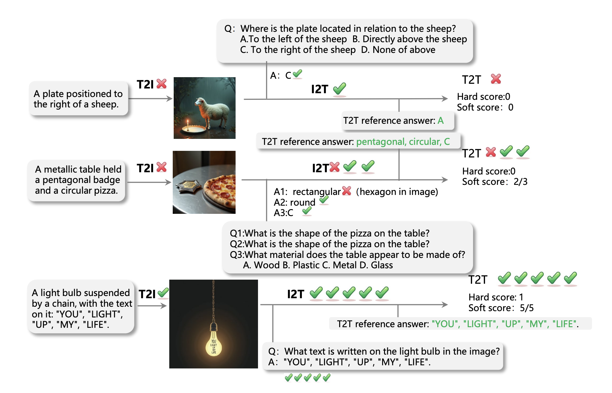
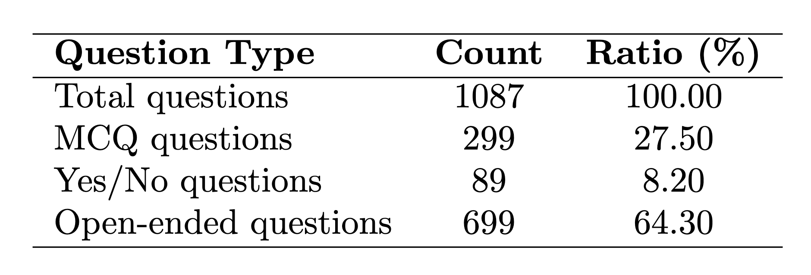
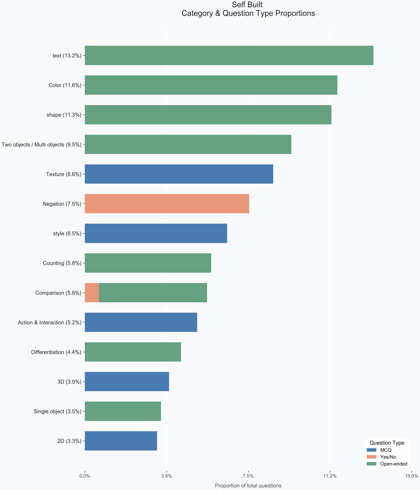
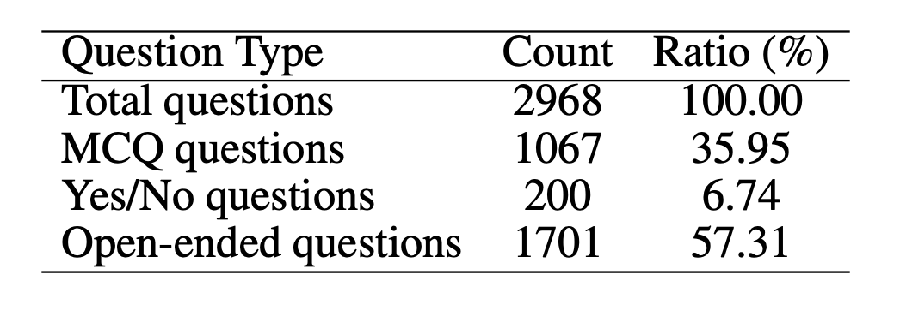
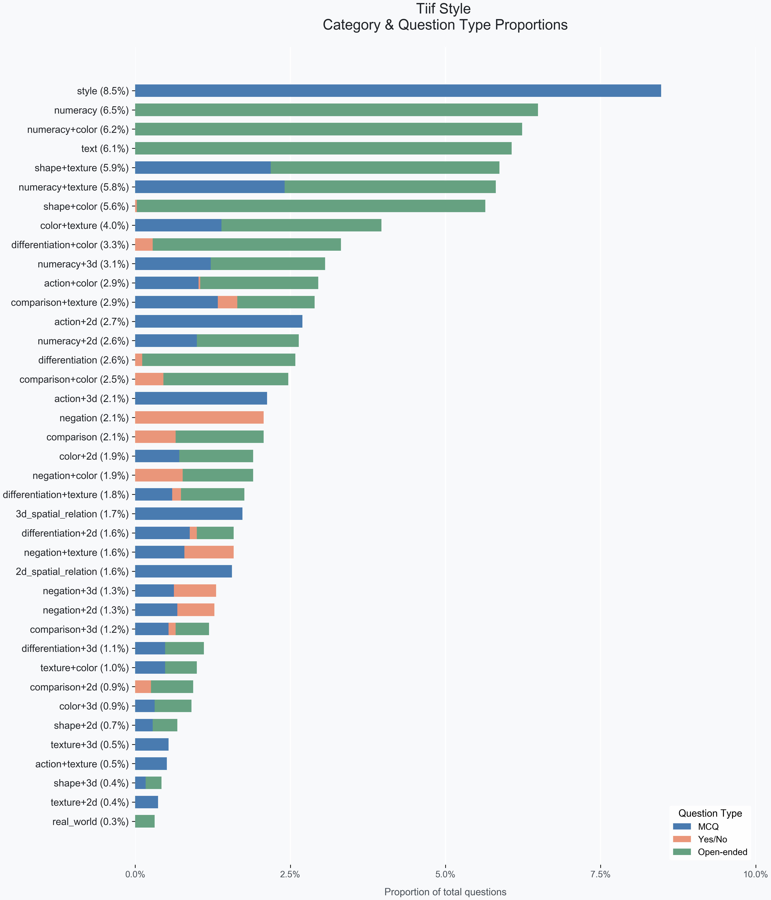
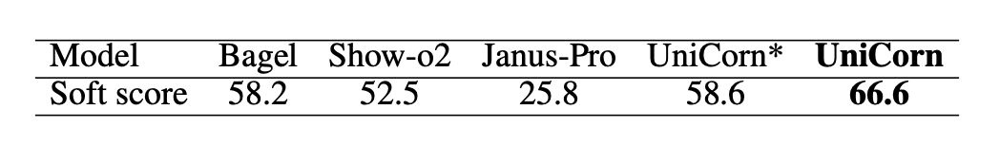
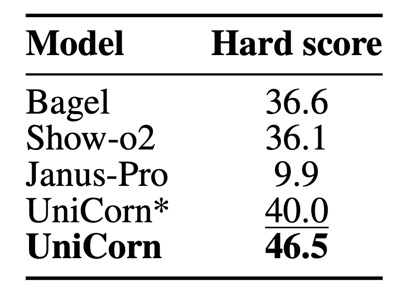

# UniCycle

UniCycle is a benchmark for **text-to-image-to-text (T2I2T) consistency**. A model is given a text prompt, generates an image, then answers visual questions about that generated image. The benchmark measures whether the final answers remain consistent with the original text prompt.

## What This Benchmark Measures

Each benchmark example contains:

- A text prompt in `short_description`
- A task/category label in `type`
- A list of QA pairs in `qa_pairs`

The evaluation pipeline is:

1. Text prompt -> image generation
2. Generated image -> visual question answering
3. Model answers -> LLM judge against the original prompt
4. Prompt-level metrics aggregation

This benchmark is intended to test whether a model preserves structured information such as:

- Spatial relations
- Negation
- Attributes and materials
- Comparative reasoning
- Action and state consistency

## Repository Layout

```text
data/
  self_built.jsonl
  tiif_style.jsonl
inference/
  run_t2t_inference.py
  t2t_bagel_inference.py
  t2t_janus_inference.py
  t2t_showo_inference.py
evaluation/
  run_t2t_eval.py
  T2T_llm_judge.py
  T2T_metric_1.py
  metrics_t2t.py
assets/
  *.png
```

## Data

The repository currently includes two benchmark files:

- `data/tiif_style.jsonl`: 1649 examples
- `data/self_built.jsonl`: 689 examples

### Required Fields

- `type`: benchmark category, for example `action+texture` or `negation+3d`
- `short_description`: the text prompt used for image generation
- `qa_pairs`: ordered list of question-answer dictionaries

Each entry in `qa_pairs` contain:

- `question`: the visual question
- `answer`: the reference answer implied by the prompt

### Example

```json
{
  "type": "action+texture",
  "short_description": "A turtle sitting on a wooden log.",
  "qa_pairs": [
    {
      "question": "What is the turtle doing in the image? A. Swimming B. Running C. Sitting D. Flying",
      "answer": "C"
    },
    {
      "question": "What material does the log appear to be made of? A. Glass B. Metal C. Wood D. Plastic",
      "answer": "C"
    }
  ]
}
```

### Example Cases

The benchmark covers prompt-to-image-to-question consistency cases such as spatial reasoning, negation, materials, and compositional attributes.



### Dataset Distribution

The two current splits have different distributions and can be used as complementary evaluation sets.

`self_built` question distribution:



`self_built` category-by-question-type distribution:



`tiif_style` question distribution:



`tiif_style` category-by-question-type distribution:



## Supported Backends

The benchmark runner currently exposes three inference backends:

- `janus`
- `bagel`
- `showo`


### Important Backend Limitation

This repository currently contains the benchmark wrappers, but **does not contain all model source code and weights required by every backend**.

- `janus` depends on the Janus codebase and model weights
- `bagel` depends on BAGEL-related modules and checkpoints
- `showo` depends on Show-o-related modules, transport code, and config files

In particular, the current repository does **not** include the full local packages referenced by:

- `inference/t2t_bagel_inference.py`
- `inference/t2t_showo_inference.py`

So for open-source users, these backends require additional code/assets in the local environment before they can run successfully.

## Installation

### 1. Create an environment

```bash
conda create -n unicycle python=3.10
conda activate unicycle
pip install -r requirements.txt
```

### 2. Install backend-specific dependencies

The benchmark runner itself uses standard Python packages plus PyTorch/OpenAI tooling, but actual inference also requires backend-specific model code and checkpoints.

At minimum:

- `janus` requires the Janus library and model weights
- `bagel` requires the BAGEL-related libraries/codebase and checkpoints
- `showo` requires the Show-o-related libraries/codebase, checkpoints, and a config file

### Backend-Specific Inference Libraries

The three inference backends are wrappers around their corresponding model ecosystems, so running inference requires the relevant backend libraries to already exist in the environment.

- `janus` inference uses Janus-specific modules such as `janus.models` and `janus.utils.io`
- `bagel` inference uses BAGEL-specific modules such as `modeling.bagel`, `modeling.autoencoder`, and related local components
- `showo` inference uses Show-o-specific modules such as `models`, `transport`, `datasets.utils`, and related config/runtime code

In other words:

- `requirements.txt` covers the shared runtime dependencies used by the benchmark wrappers
- backend inference still depends on the corresponding Janus / BAGEL / Show-o libraries and checkpoints

If you want this repository to be fully runnable by external users, you should either:

1. Vendor or submodule the required backend codebases into the project, or
2. Add explicit setup instructions for each backend library and checkpoint

## Minimal Commands

### End-to-End Evaluation

The recommended entrypoint is:

```bash
python evaluation/run_t2t_eval.py \
  --backend janus \
  --bench data/self_built.jsonl \
  --output_dir output \
  --model_path deepseek-ai/Janus-Pro-7B \
  --api_key "$OPENAI_API_KEY" \
  --judge_model gpt-4o-mini
```

This command runs:

1. Inference
2. LLM judging
3. Metric aggregation

### Inference Only

```bash
python inference/run_t2t_inference.py \
  --backend janus \
  --input data/self_built.jsonl \
  --output output/janus_predictions.jsonl \
  --out_image_dir output/janus_images \
  --model_path deepseek-ai/Janus-1.3B
```

### Shell Wrapper

```bash
bash evaluation/run_t2t_eval.sh \
  --backend janus \
  --bench data/self_built.jsonl \
  --output_dir output \
  --model_path deepseek-ai/Janus-1.3B \
  --api_key "$OPENAI_API_KEY"
```

## Evaluation Outputs

`evaluation/run_t2t_eval.py` writes the following files into `--output_dir`:

- `<run_name>_predictions.jsonl`: raw inference output
- `<run_name>_judged.jsonl`: question-level rows with LLM judge outputs
- `<run_name>_question_scores.jsonl`: question-level file with prompt scores written back
- `<run_name>_prompt_scores.jsonl`: prompt-level metrics
- `<run_name>_images/`: generated images

### Judged Output Fields

Typical fields include:

- `type`
- `short_description`
- `q_index`
- `question`
- `reference_answer`
- `answer`
- `answer_norm`
- `llm_judge`
- `llm_raw`
- `llm_error` if the judge request failed

`llm_error` means the judge row could not be evaluated normally, typically because the API request failed or the returned content could not be parsed into the expected JSON format.

`no_eval` is a reserved evaluation value used when a row should be excluded from normal metric computation. It is filtered from standard prompt scoring.

### Metric Output

Prompt-level metrics currently include:

- `soft_score`
- `hard_score`
- `strict_soft_score`
- `strict_hard_score`
- `has_no_eval`
- `has_llm_error`

Metric meanings:

- `soft_score`: average prompt-level score over valid evaluated questions
- `hard_score`: `1.0` only if the prompt-level soft score is exactly `1.0`, otherwise `0.0`
- `strict_soft_score`: if any question under the same prompt has `no_eval` or `llm_error`, the prompt receives `0.0`; otherwise it matches `soft_score`
- `strict_hard_score`: hard version of `strict_soft_score`
- `has_no_eval`: whether any question belonging to the prompt was filtered as `no_eval`
- `has_llm_error`: whether any question belonging to the prompt had a judge failure

The metric implementation is in [evaluation/metrics_t2t.py](/Users/xinyujo/Downloads/Unicycle/evaluation/metrics_t2t.py).

### Result Visualizations

The repository also includes summary result plots for benchmark reporting:

Soft-score results:



Hard-score results:


